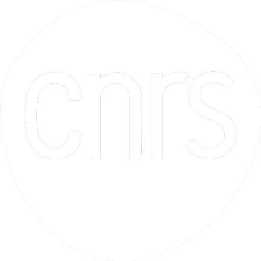

<!--

-->

# Simon Gravelle

Computer physicist in soft matter and fluids at interfaces in LIPhy, UGA, CNRS

<!--

-->

## What I share here on GitHub:

- Molecular dynamics inputs for LAMMPS and GROMACS
- Scripts for preparing and analyzing molecular dynamics simulations
- Data from my recent publications

<!--

-->

## Main open-source projects:

- LAMMPS tutorials [:link:](https://lammpstutorials.github.io/) LAMMPS step-by-step guides for absolute beginners
- GROMACS tutorials [:link:](https://gromacstutorials.github.io/) GROMACS step-by-step guides for absolute beginners
- NMRforMD [:link:](https://nmrformd.readthedocs.io) Python script for the calculation of H-NMR relaxation time
- MDcourse [:link:](https://github.com/mdcourse) Learn molecular simulations using Python (under construction)
- MAICoS [:link:](https://maicos-devel.gitlab.io/maicos/index.html) molecular analysis of interfacial and confined systems 

<!--
## My Youtube channel

-->

## Youtube channel

Videos of molecular simulations, mostly done with LAMMPS and GROMACS [:link:](https://www.youtube.com/c/SimonGravelle) 

## See also

- The gallery of molecules [:link:](https://github.com/simongravelle/gallery) high-resolution molecules with scripts 
- ATB2LAMMPS [:link:](https://github.com/simongravelle/atb2lammps) a LAMMPS molecule template generator

<!--
# GitHub stats

 
-->
