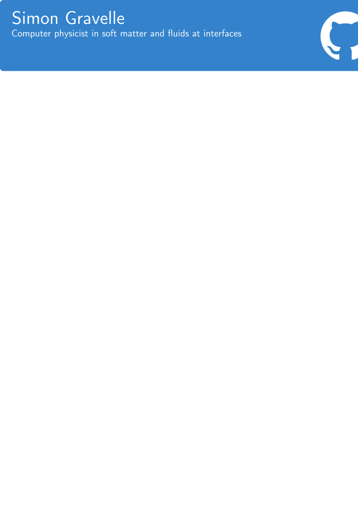

# What I share here:

- Molecular dynamics inputs for LAMMPS and GROMACS
- Scripts for preparing and analyzing molecular dynamics simulations
- Data from my recent publications

# Main open-source projects:

- LAMMPS tutorials [:link:](https://lammpstutorials.github.io/) LAMMPS step-by-step guides for absolute beginners
- GROMACS tutorials [:link:](https://gromacstutorials.github.io/) GROMACS step-by-step guides for absolute beginners
- NMRforMD [:link:](https://nmrformd.readthedocs.io) Python script for the calculation of H-NMR relaxation time
- MDcourse [:link:](https://github.com/mdcourse) Learn molecular simulations using Python (under construction)

# My Youtube channel

# See also

- MAICoS [:link:](https://maicos-devel.gitlab.io/maicos/index.html) molecular analysis of interfacial and confined systems 
- The gallery of molecules [:link:](https://github.com/simongravelle/gallery) high resolution molecules with scripts 
- ATB2LAMMPS [:link:](https://github.com/simongravelle/atb2lammps) a LAMMPS molecule template generator

<!--
# GitHub stats

 
-->
