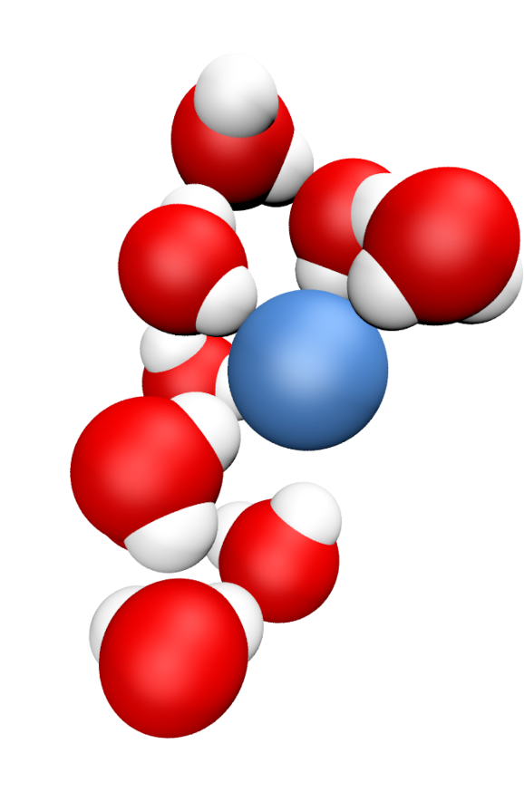

## Hi, I'm Simon

Computer physicist in soft matter and fluids at interfaces. I am into open science. You can find my [personal webpage here](https://simongravelle.github.io/).

What I share here:

- molecular dynamics inputs for LAMMPS and GROMACS
- python scripts for preparing and analysing molecular dynamics simulations
- the data and scripts that are linked to my [recent publications](https://github.com/simongravelle/publication-data)

Find more:

- [lammpstutorials.github.io](https://lammpstutorials.github.io/) - LAMMPS step-by-step guides for absolute beginners
- [gromacstutorials.github.io](https://gromacstutorials.github.io/) - GROMACS step-by-step guides for absolute beginners
- [youtube channel](https://www.youtube.com/c/SimonGravelle) - videos from molecular simulation trajectories
- [maicos](https://maicos-devel.gitlab.io/maicos/index.html) - molecular analysis tookit for analysing interfacial and confined systems

<!--

  

<a href="lammpstutorials.github.io" style="text-decoration:none">lammpstutorials.github.io</a>

-->
