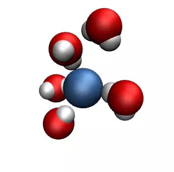

## NaCl ions in water

### Description

This is the LAMMPS script used to produce this simulation: 

The system consists of a single chloride ion and five water molecules. The state.vmd file contains the VMD parameters. 

### Contact

Feel free to contact me by email if you have inquiries. You can find contact details on my [personal page](https://simongravelle.github.io/).
